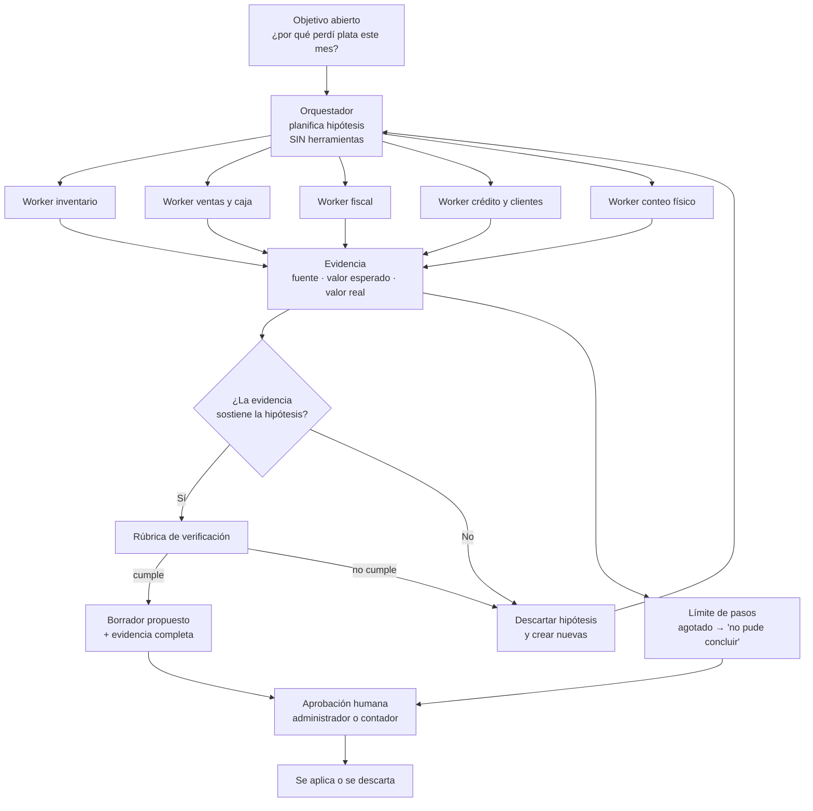

# Propuesta de agente autónomo de IA: El Consejero

**Proyecto:** PharmaSync — Sistema Integral de Gestión para Droguería
**Materia:** Emprendimiento
**Tipo de entrega:** Propuesta técnica de valor agregado

---

## Resumen ejecutivo

PharmaSync es, por diseño, un sistema de **workflows**: 741 requisitos funcionales
distribuidos en 11 módulos, reportes calculados, alertas por reglas deterministas y
un punto de venta que debe seguir cobrando aunque se caiga internet. Ese 95% del
sistema es correcto y no debe tocarse con inteligencia artificial.

Existe, sin embargo, un hueco que ningún workflow cubre. En una droguería hay **seis
fuentes de verdad que deben coincidir entre sí** —inventario, ventas, caja, documentos
fiscales, crédito de clientes y el conteo físico— y hoy **nadie las cruza**. En todo el
repositorio la palabra "conciliación" aparece dos veces, y ninguna como módulo. El
dueño no tiene un reporte que le diga si sus números son ciertos; solo tiene reportes que le
dicen qué registró el sistema, que es una cosa distinta.

La propuesta es **El Consejero**: un agente de investigación del negocio que recibe un
objetivo abierto ("¿por qué perdí plata este mes?"), busca en un espacio de causas que
nadie puede enumerar de antemano, verifica cuáles existen con evidencia, y propone la
corrección. Nunca escribe: redacta borradores que el administrador o el contador aprueban.

La misma máquina —un solo motor de investigación— se aplica a cuatro objetivos:
integridad del dinero, fugas de dinero, ventas que se están perdiendo y salud operativa.
El valor está en el motor, no en los objetivos.

---

## 1. Marco conceptual

### 1.1 Qué es un agente de IA

Un agente es un sistema capaz de alcanzar un objetivo **sin que le prescriban el
camino completo**. Se apoya en cuatro ideas:

- **Percepción:** recibe información estructurada y no estructurada del entorno.
- **Razonamiento y decisión:** elige la siguiente acción; aquí es donde se diferencia de
  un modelo predictivo, que solo estima.
- **Herramientas:** ejecuta acciones sobre sistemas externos (APIs, base de datos,
  servicios) que amplían lo que el modelo puede hacer por sí solo.
- **Autonomía:** itera. Termina la tarea, evalúa si alcanzó el objetivo, y si no, crea
  tareas adicionales y vuelve a intentarlo.

### 1.2 El bucle del agente

```
Pedir herramienta → Ejecutar → Observar el resultado real → Decidir → (repetir con límite de pasos)
```

Si el sistema **no decide**, es un flujo. Si decide, es agéntico. Esa distinción es el
eje de toda esta propuesta.

### 1.3 Las tres decisiones de diseño

Siguiendo las recomendaciones de arquitectura para soluciones agénticas:

| Decisión | Qué significa | Por qué no es opcional |
|---|---|---|
| **Entorno** | Qué es lo que el agente ve | Sin un entorno declarado, el modelo improvisa sobre datos que nadie eligió darle |
| **Herramientas** | A través de qué puede actuar | Es lo que le permite salir de la conversación y afectar el mundo real |
| **Verificación** | Cómo sabe que va avanzando | Sin verificación no hay progreso verificable, solo texto plausible |

Cualquier otro ajuste es optimización.

---

## 2. El filtro: cuándo **no** usar un agente

Este es el punto que sostiene la propuesta, y también lo que la hace defendible.

El criterio de diseño es: **si puedes fijar el camino por adelantado, ganas un
workflow.** Un agente solo se justifica cuando el camino depende de lo que se observe
en cada paso, pero el progreso todavía se puede verificar.

### 2.1 Lo que PharmaSync ya resuelve sin IA

| Capacidad | Implementación actual |
|---|---|
| Reglas de negocio completas | 741 requisitos funcionales en 11 módulos (`docs/main.md`, §1.4) |
| Reportes calculados | 6 endpoints: `sales-summary`, `cash-shift-summary`, `inventory-valuation`, `tax-summary`, `fiscal`, `daily` (`reports.controller.ts`) |
| Alertas por condición | 14 reglas deterministas en `suggestion-rules.ts` (fallos permanentes de sync, facturas de contingencia por expirar, turno extendido, lote por vencer, bendiciones rechazadas…) |
| Asistente de usuario | Paleta de comandos con ejecución real (`assistant/commands.ts`) |
| Detección de fraude de licencias | 9 detectores con severidad y acción (`licensing/fraud/fraud-detection.service.ts`) |

Todo eso es correcto y debe seguir siendo software determinista. Meter un modelo
generativo ahí sería pagar más por hacer lo mismo peor.

### 2.2 La prueba binaria

Para cada tarea candidata, una sola pregunta:

> **Antes de observar nada, ¿puedo nombrar la siguiente herramienta que se va a llamar?**

- **Si la respuesta es sí** → es un workflow. Gana la automatización.
- **Si la respuesta es "depende de lo que vea"** → es un agente.

Casos descartados por esta prueba, dentro y fuera de este proyecto:

| Tarea | Veredicto |
|---|---|
| Alerta de lote por vencer (FEFO) | Regla. `si fecha_vencimiento - hoy < 30 días → avisar` |
| Sugerencia de reponer stock | Regla. Umbral de mínimos y máximos |
| Corrección de una factura rechazada por el PT | Cambio de código. El flujo es determinista |
| Lectura de la factura de un proveedor | Pipeline. Leer → mapear → draft → aprobar |
| Bot de WhatsApp con botones y comandos | Automatización. El usuario ya conoce los menús |
| **¿Por qué el CPP de esta categoría está inflado?** | **Depende: no sabemos todavía cuál de las 6 fuentes divergió** |

### 2.3 El hueco que queda

El agente solo puede existir donde **no hay métrica, no hay umbral, y no se sabe qué
preguntar**. Ese hueco, en este dominio, es la búsqueda de la causa raíz.

---

## 3. El problema real, con evidencia

### 3.1 Seis fuentes de verdad sin cruzar

Cada droguería opera con seis registros que deberían decir lo mismo y que hoy viven
aislados:

| # | Fuente | Modelos / evidencia |
|---|---|---|
| 1 | **Inventario por lote y costo promedio ponderado (CPP)** | `lot`, `inventory-movement`, `product-cost-history`, `purchase-reception` |
| 2 | **Ventas y anulaciones** | `sale`, `sale-item`, `sale-item-lot`, generadas en POS local, a veces offline |
| 3 | **Caja** | `cash-shift`, `shift-cash-count` — cuadre por medio de pago y diferencias de turno |
| 4 | **Documentos fiscales** | `fiscal-document`, `fiscal-resolution`, notas crédito/débito, contingencia, exógena |
| 5 | **Crédito y saldos de cliente** | `client-credit-payment`, `client-return` |
| 6 | **Físico** | `physical-count` y `physical-count-line` — lo que realmente hay en la bodega |

El sistema **produce** las cifras (módulo 10, 79 RF de reportes) pero **nadie las
compara**. Para el dueño, la pregunta relevante no es "¿cuánto vendí?", sino:

> **"¿Mis números son ciertos, o estoy pagando impuestos y declarando sobre un
> inventario que no existe?"**

### 3.2 El tamaño del hueco técnico

- El esquema de datos supera los 40 modelos
  (`packages/database/prisma/schema/models/`).
- La sincronización maneja **22 tipos de operación** (`SyncOperationType`), con hasta
  **10 reintentos** antes de marcar `PERMANENT_FAILURE` (`sync-push.service.ts:42`), y
  resolución de conflictos por regla `FIRST_WRITE_WINS` en el merge local
  (`local-sync/operation-merge.ts`).
- El backoffice del tenant **no tiene pantalla de salud de sincronización**; la vista
  existe en el POS y está restringida a ADMIN.

Cruzar todo eso es un grafo de dependencias cuyo tamaño crece de forma combinatoria con
el número de operaciones, estaciones, lotes y días. **Nadie puede escribir el workflow
completo, porque el espacio de casos no se puede enumerar de antemano.**

### 3.3 Por qué no es "un bug más"

Este es el argumento central, y el que suele ser objeto de debate.

El código de PharmaSync es determinista: la misma entrada produce siempre la misma
salida. Si una factura falla, es porque hay un dato o una regla mal, y se corrige en el
código. **Eso no aplica aquí.**

Lo que produce una divergencia en este sistema es un **hecho del negocio incompleto**,
no un defecto de software. Ejemplos reales del dominio:

- Una recepción de mercancía se registró dos veces. El CPP se recalcula ponderado en la
  confirmación de recepción (`purchase-receptions.service.ts`), de modo que **el error
  no queda en la recepción: se propaga silenciosamente al margen de todas las ventas
  siguientes**, hasta que alguien lo detecta.
- Un lote fue bloqueado por vencimiento, pero sigue contado como disponible en el
  conteo físico.
- Una devolución de cliente quedó devengada y nunca procesada.
- Una venta se confirmó en el POS mientras estaba offline, el stock se descontó local,
  y al hacer merge una escritura del servidor ganó: el movimiento existe en un lado
  solamente.
- Un anulado de venta se justificó con un motivo que no refleja lo que pasó.

En ninguno de esos casos hay un bug. El código hizo lo que debía. **Falta información
sobre hechos que ocurrieron, y la única fuente de esa información es la persona que
estuvo ahí.** Un contador puede detectarlo por muestreo; una regla, nunca; solo se
descubre investigando.

---

## 4. El Consejero: un motor, cuatro objetivos

### 4.1 La máquina

El Consejero no tiene cuatro sistemas: tiene **uno**, y cambia el objetivo.

```
Objetivo abierto
      │
      ▼
 Hipótesis inicial ──► ¿Cuál podría ser la causa?
      │
      ▼
 Observación (consulta herramientas, en paralelo)
      │
      ▼
 ¿La evidencia sostiene la hipótesis?
   ├── Sí ──► Hallazgo con evidencia ──► Propuesta de borrador ──► Aprobación humana
   └── No ──► Descartar hipótesis ──► Crear hipótesis nuevas ──► (vuelve a observar)
                                                      │
                                    Si se agotan los pasos y no hay conclusión:
                                    declarar explícitamente "no pude concluir"
```

El paso de **descartar y reasignar** es lo que lo convierte en agente y no en un
reporte. Un reporte responde la pregunta que le hicieron. El agente tiene que
**encontrar** la pregunta.

### 4.2 Objetivo A — Integridad del dinero (núcleo)

> *"Al cierre de mes, determina si las cifras que el sistema declara son ciertas."*

Verificable: las fuentes vuelven a cuadrar, o la divergencia queda explicada con
evidencia.

Por qué no es un workflow: el agente **no sabe de antemano cuál de las seis fuentes
divergió**, ni cuántas divergen a la vez, ni en qué dirección. La siguiente fuente que
hay que consultar depende del resultado de la anterior. Y la hipótesis inicial
frecuentemente es incorrecta: empieza sospechando del CPP y termina encontrando que la
recepción se duplicó, lo que obliga a abrir una búsqueda que no estaba prevista.

### 4.3 Objetivo B — Fugas de dinero

> *"¿En qué se me va la plata que no estoy viendo?"*

Causas candidatas que hoy nadie mide ni cruza:

- Descuentos aplicados por encima del permitido por rol o por clasificación de cliente.
- Anulaciones de venta cuyo motivo real difiere del motivo registrado.
- Ajustes de inventario etiquetados como "producto averiado" que se repiten sobre el mismo producto.
- Crédito a clientes concedido y nunca cobrado, o pagado y nunca registrado.
- Ventas de bajo margen de forma sistemática por mezcla de producto, no por precio.

Verificable: cada fuga tiene una serie de operaciones concretas detrás, con monto
calculado y evidencia.

Por qué no es un workflow: el umbral de "descuento alto" no existe porque un 12% puede
ser correcto en un caso y una fuga en otro. **La anomalía está en la relación entre
operaciones**, y esa relación no se declara de antemano.

### 4.4 Objetivo C — Ventas que se están perdiendo

> *"Este mes crecí menos que antes. ¿Por qué?"*

Aquí conviene ser preciso, porque el lugar-común de este objetivo sí es un workflow y
por lo tanto queda **excluido**: "producto sin rotación → descuento" es una regla y no
entra en la propuesta.

Lo que sí entra es la búsqueda de la causa. El dueño pierde facturación y **no sabe por
qué**. Las candidatas son muchas y se superponen: caída de rotación en una categoría,
cambio de mezcla, quiebre de stock en una fecha concreta, el cliente no volvió a la
segunda compra de un tratamiento crónico, erosión de precio, o estacionalidad real.
Distinguirlas exige consultar, descartar y volver a consultar; **no existe un conjunto
finito de condiciones que las separe**, y el agente solo propone una acción comercial
cuando tiene evidencia de la causa, no cuando tiene una intuición.

Verificable: el hallazgo incluye la serie histórica que demuestra la pérdida y la
magnitud estimada.

### 4.5 Objetivo D — Salud operativa

> *"La caja no puede facturar. Encuentra por qué."*

Por qué no es un workflow, y por qué es el argumento técnico más fuerte: en un sistema
local-first con 22 tipos de operación, 10 reintentos, resolución de conflictos por regla
y varias estaciones, **el mismo código produce estados distintos según el momento de la
red**. El espacio de estados es emergente y el desarrollador no lo reproduce nunca de
forma determinista. No hay un conjunto enumerable de causas, hay una búsqueda.

Posibles causas reales: turno abierto en otra estación, token offline expirado,
bendición de sesión pendiente, documento fiscal en contingencia, certificado digital
vencido, fallo permanente en la cola, resolución sin consecutivos disponibles.

Verificable: se reproduce la condición bloqueante, se interviene, y se comprueba que
desapareció. El agente ejecuta solo lo reversible (re-encolar, re-bendecir, reabrir) y
escala lo demás con evidencia.

---

## 5. Arquitectura

### 5.1 Las tres decisiones, resueltas

**Entorno (qué ve).** Logs de auditoría, cola de sincronización, documentos XML y sus
resultados, conteos físicos, arqueos de turno, historial de precios y costos, y las
series de tiempo de cada indicador. El entorno se declara explícitamente; el modelo no
recibe "la base de datos".

**Herramientas (qué puede hacer).** Un **MCP del dominio** con operaciones tipadas y
con alcance de tenant:

| Herramienta | Responde |
|---|---|
| `consultar_movimientos_inventario(producto, rango)` | ¿Cómo llegó el stock a su valor actual? |
| `consultar_lotes_y_vencimientos(rango)` | ¿Qué lotes existen y cuáles están bloqueados? |
| `consultar_ventas(rango, filtros)` | ¿Qué se vendió, se anuló y se devolvió? |
| `consultar_turnos_y_arqueos(rango)` | ¿Cuánto dinero entró por cada medio de pago? |
| `consultar_documentos_fiscales(rango, estado)` | ¿Qué se emitió, transmitió o rechazó? |
| `consultar_conteos_fisicos(rango)` | ¿Qué dijo el conteo físico? |
| `consultar_credito_clientes(rango)` | ¿Cuánto se prestó y cuánto se cobró? |
| `proponer_borrador(ajuste, evidencia)` | Único mecanismo de escritura, y produce un borrador |

La regla es dura: **el modelo no escribe SQL libre ni toca tablas**. Solo usa
herramientas declaradas, y la única que altera estado produce un borrador que un humano
aprueba.

**Verificación (cómo sabe que avanza).** Rúbrica de salida, no opcional:

1. Todo hallazgo declara **fuente**, **valor esperado**, **valor real** y **evidencia**.
2. Un hallazgo sin evidencia no se emite.
3. Si las fuentes no cuadran y el agente no logra explicarlo, **declara que no pudo
   concluir**. No rellena el hueco con una explicación plausible.

### 5.2 Arquitectura del bucle



Las seis fuentes de verdad se consultan en paralelo; el orquestador no accede a datos y
los workers no toman decisiones de negocio.

### 5.3 Patrones de diseño aplicados

| Patrón | Aplicación en El Consejero |
|---|---|
| **Prompt chaining** | Extraer evidencia → cruzar fuentes → evaluar hipótesis → redactar hallazgo. Cada etapa consume la salida de la anterior |
| **Enrutamiento** | Modelo barato para leer y normalizar; modelo potente solo cuando hay que decidir entre hipótesis contradictorias |
| **Paralelización** | Las seis fuentes se consultan al mismo tiempo. La latencia total es la de la más lenta, no la suma |
| **Orquestador – Worker** | El orquestador planifica hipótesis y **no tiene herramientas**; los workers sí. Así el razonamiento no toca datos y los datos no razonan |
| **Evaluador – Optimizador** | Un evaluador exige la evidencia antes de dejar pasar un hallazgo; si falla, el hallazgo vuelve al orquestador con el motivo del rechazo |

### 5.4 Control operativo

- **Human-in-the-loop sin excepción:** el agente no aprueba nada.
- **Límite de pasos** por ejecución, para acotar costo y tiempo.
- **Idempotencia:** reejecutar el mismo objetivo no duplica borradores.
- **Jitter y reintentos con backoff** ante errores transitorios, para que muchas
  droguerías no consulten lo mismo en el mismo segundo.
- **Degradación elegante:** si el modelo no está disponible, el dueño sigue recibiendo
  el parte determinista que el sistema ya produce. El agente es una capa, no el sistema.

---

## 6. Guardarraíles

| Riesgo | Mitigación |
|---|---|
| Alucinación de una pérdida inexistente | Rúbrica de evidencia obligatoria; sin evidencia no hay hallazgo |
| Que el modelo "arregle" una factura mal formada | Prohibido por diseño: el agente no tiene herramienta de escritura fiscal |
| Inyección de instrucciones desde datos externos | XML, notas de cajero y respuestas de la DIAN se tratan como **datos**, nunca como instrucciones |
| Salida mal formada | Validación Zod en la frontera, igual que el resto del sistema |
| Fuga de datos entre droguerías | Alcance de tenant obligatorio en cada herramienta; el agente nunca ve datos de otra droguería |
| Sesgo o decisión autónoma sobre un paciente | Fuera de alcance: el agente no da indicaciones sanitarias ni MCC, no toca receta médica ni datos clínicos |

---

## 7. Diseño del demo (propuesta, no implementado)

Un CLI en TypeScript, sobre el mismo stack del repositorio, con un mes de datos
sembrados y **una discrepancia real escondida**: una recepción de mercancía registrada
dos veces, que altera el CPP ponderado y por tanto el margen de todas las ventas
siguientes.

Al ejecutar se observa:
1. Hipótesis inicial del orquestador (sospecha del reporte fiscal).
2. Consulta en paralelo de las seis fuentes.
3. **Descarte** de la hipótesis inicial.
4. Hipótesis nueva, seguida de una búsqueda que no estaba prevista.
5. Hallazgo con evidencia: dos recepciones idénticas, fecha, lote, costo y efecto en el
   CPP.
6. Borrador de corrección propuesto, sin haber escrito nada.

Costo de implementación estimado: bajo, porque reutiliza los esquemas Prisma del
proyecto y no requiere dependencias nuevas.

---

## 8. Modelo de negocio

**Propuesta comercial:** módulo **Premium** por encima del plan base, vendido a la
droguería como "el asesor que no puede contratar".

**Ancla de precio:** el trabajo que hoy se le encarga a un contador o a una asesoría
contable, con un costo mensual de referencia de $120.000 COP más IVA. El módulo se
posiciona por debajo de ese valor y se justifica por el hallazgo, no por la licencia.

**Ingresos secundarios:**
- Reducción del costo de soporte: el objetivo D ataca el problema que más recursos
  consume en un producto local-first.
- Retención: un cliente que cada mes recibe hallazgos reales de su propio negocio tiene
  motivos concretos para renovar.

**Indicadores de éxito del módulo:**

| Indicador | Meta |
|---|---|
| Tiempo de cierre contable mensual | Reducción medible frente al proceso manual |
| Fugas detectadas sobre el universo de transacciones | Porcentaje de divergencias identificadas frente al total de transacciones del período |
| Falsos positivos | Porcentaje de hallazgos descartados por el usuario |
| Hallazgos aceptados sin edición | Porcentaje de propuestas aprobadas tal cual |
| Time-to-value | Días desde la activación hasta el primer hallazgo reportado |

---

## 9. Objeciones previstas

| Objeción | Respuesta |
|---|---|
| "Esto ya lo hace un reporte" | Los reportes responden la pregunta que se les hace; el agente encuentra la pregunta. Nadie programó un reporte de "estas seis fuentes no cuadran" porque no existía el requisito de cruzarlas: nadie sabía que fuera necesario cruzarlas |
| "Una regla o un dashboard es más barato" | Una regla detecta lo que se le ocurrió anticipar. Estas divergencias son hechos de negocio, no condiciones de entrada. El costo por hallazgo no es el motivo de la decisión; el motivo es que las reglas no las pueden ver |
| "Un LLM en un sistema financiero es un riesgo" | El modelo no escribe. Su única salida es un borrador validado con Zod, revisado por un humano. El 95% determinista del sistema queda intacto |
| "Los programas son deterministas, esto no aplica" | El código sí lo es, y por eso un error de factura se arregla cambiando código. Lo que aquí falla no es el código: es que un hecho del negocio nunca se registró. No hay cambio de código que registre lo que nadie vio |
| "¿No es mejor que un humano?" | El humano es quien decide. El agente hace la búsqueda que a un humano le tomaría días y que solo pagaría si ya sospecha algo. El valor está en la cobertura, no en reemplazar el criterio |
| "La IA no puede garantizar la verdad" | Correcto, y por eso la respuesta no es una certeza sino un hallazgo con evidencia y una propuesta. La rúbrica obliga a que cada afirmación sea verificable por el contador, que es quien la valida |

---

## 10. Conclusión

PharmaSync no necesita inteligencia artificial para funcionar: necesita la inteligencia
artificial para **saber si está diciendo la verdad**. La diferencia entre un sistema de
transacciones y un sistema que acompaña al dueño en sus decisiones más difíciles es
exactamente la diferencia entre un workflow y un agente.

El 95% del producto debe seguir siendo software determinista, rápido y auditable. El 5%
restante —buscar por qué el mundo no cuadra cuando nadie sabe qué buscar— es el único
trabajo que ninguna regla resuelve, y es el que más cuesta al dueño de una droguería.

Ese es el valor agregado: no una función nueva, sino **la capacidad de encontrar
problemas que nadie sabía que existían**.

---

## 11. Guion de sustentación

Duración aproximada: 5 minutos.

**1. La tesis y el filtro (60 s).**
PharmaSync tiene 741 requisitos funcionales, 6 reportes y 14 alertas por reglas. Todo eso
es correcto y es un workflow. La pregunta correcta no es "dónde meto IA", sino "qué tarea
no puede ser un workflow". La respuesta: aquella donde el camino depende de lo que se
observa, y no hay forma de enumerar los casos de antemano.

**2. El problema (60 s).**
Una droguería tiene seis registros que deberían decir lo mismo y que nadie cruza:
inventario, ventas, caja, documentos fiscales, crédito de clientes y el conteo físico. El
dueño tiene reportes que le dicen qué registró el sistema, no si eso es cierto. Y la
diferencia importa: una recepción duplicada no se queda en la recepción, se propaga por
el costo promedio ponderado y corrompe el margen de todas las ventas siguientes.

**3. El agente (90 s).**
Un objetivo abierto, hipótesis, observación paralela de las seis fuentes, y una decisión:
¿la evidencia sostiene la hipótesis? Si no, se descarta y se crean hipótesis nuevas. Ese
descarte es lo que lo convierte en agente y no en reporte. Se muestra el diagrama: el
orquestador planifica y no tiene herramientas; los workers consultan y no deciden. Ningún
hallazgo sale sin fuente, valor esperado, valor real y evidencia; si no cuadra y no se
explica, el agente declara que no pudo concluir.

**4. Por qué no lo arregla un cambio de código (45 s).**
Porque el código es determinista y aquí no hay bug. Lo que falta es un hecho del negocio
que nadie registró. No existe parche que registre lo que nadie vio. Por eso tampoco lo
resuelve una regla: una regla detecta únicamente lo que alguien anticipó al programarla.

**5. Negocio y demo (45 s).**
Módulo Premium por debajo del costo de un contador, justificado por el hallazgo y no por
la licencia. El demo es un CLI con un mes de datos sembrados y una discrepancia
escondida, para que se vea el bucle funcionando y no una maqueta.

**Cierre (15 s).** El 95% del producto debe seguir siendo software determinista. El 5%
restante es el único trabajo que ninguna regla resuelve, y es el que más le cuesta al
dueño de una droguería.
